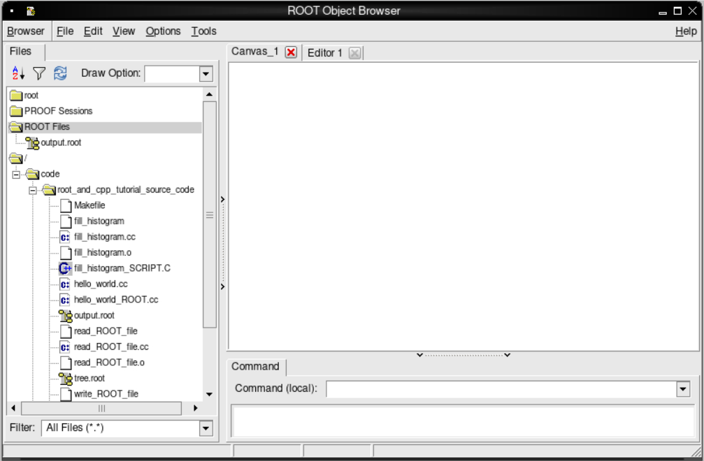
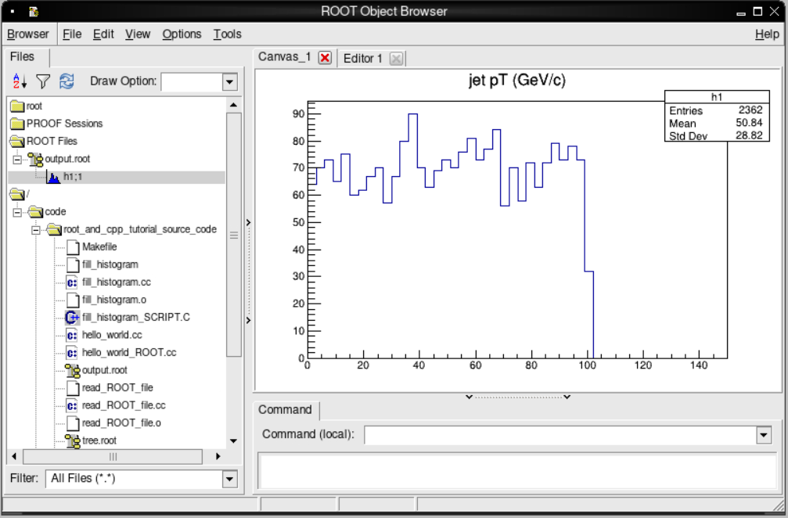
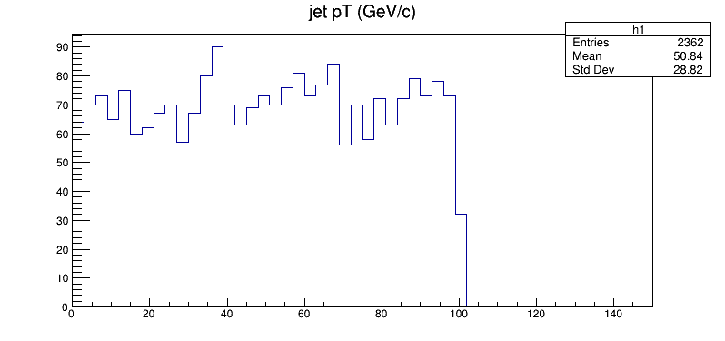

## Filling a histogram

ROOT can easily fill a histogram as you are looping over individual events. Let's
try creating and filling a histogram with the transverse momentum values. We'll start
with the `read_ROOT_file.cc` code we wrote in the previous episode and copy what
we have to a new file, `fill_histogram.cc`.

~~~
cp read_ROOT_file.cc fill_histogram.cc
~~~
{: .language-bash}

Into this file, we'll add some lines at some key spots. Again, use your favourite editor on your local computer. For now, we'll go through those lines
of code individually, and then show you the completed file at the end to see where they went.

First we need to include the header file for the ROOT [TH1F](https://root.cern.ch/doc/master/classTH1F.html) class.

~~~
#include "TH1F.h"
~~~
{: .language-cpp}

We create an output file to store the histogram in.

~~~
   // Let's make an output file which we'll use to save our
   // histogram
   TFile fout("output.root","recreate");
~~~
{: .language-cpp}

Define the histogram.
~~~
   // We define an histogram for the transverse momentum of the jets
   // The arguments are as follow
   // * Internal name of the histogram
   // * Title that will be used if the histogram is plotted
   // * Number of bins
   // * Low edge of the lowest bin
   // * High edge of the highest bin
   TH1F h1("h1","jet pT (GeV/c)",50,0,150);
~~~
{: .language-cpp}

And then *inside the event loop*, we fill the histogram each time we get a new value for
the transverse momentum.

~~~
         // Fill the histogram with each value of pT
         h1.Fill(pt[j]);
~~~
{: .language-cpp}

Before we leave the function, we "change directory" to the output file, write the histogram
to the file, and then close the output file.

~~~
   fout.cd();
   h1.Write();
   fout.Close();
~~~
{: .language-cpp}

The final version of `fill_histogram.cc` will look like this.

> ## Source code for `fill_histogram.cc`
>
> ~~~
> #include<cstdio>
> #include<cstdlib>
> #include<iostream>
>
> #include "TROOT.h"
> #include "TTree.h"
> #include "TFile.h"
> #include "TRandom.h"
> #include "TH1F.h"
>
> int main() {
>
>   // Here's the input file
>   // Without the 'recreate' argument, ROOT will assume this file exists to be read in.
>   TFile f("tree.root");
>
>   // Let's make an output file which we'll use to save our
>   // histogram
>   TFile fout("output.root","recreate");
>
>   // We define an histogram for the transverse momentum of the jets
>   // The arguments are as follow
>   // * Internal name of the histogram
>   // * Title that will be used if the histogram is plotted
>   // * Number of bins
>   // * Low edge of the lowest bin
>   // * High edge of the highest bin
>   TH1F h1("h1","jet pT (GeV/c)",50,0,150);
>
>   // We will now "Get" the tree from the file and assign it to
>   // a new local variable.
>   TTree *input_tree = (TTree*)f.Get("t1");
>
>   Float_t met; // Missing energy in the transverse direction.
>
>   Int_t njets; // Necessary to keep track of the number of jets
>   // We'll define these assuming we will not write information for
>   // more than 16 jets. We'll have to check for this in the code otherwise
>   // it could crash!
>   Float_t pt[16];
>   Float_t eta[16];
>   Float_t phi[16];
>
>   // Assign these variables to specific branch addresses
>   input_tree->SetBranchAddress("met",&met);
>   input_tree->SetBranchAddress("njets",&njets);
>   input_tree->SetBranchAddress("pt",&pt);
>   input_tree->SetBranchAddress("eta",&eta);
>   input_tree->SetBranchAddress("phi",&phi);
>
>   // Get the number of events in the file
>   Int_t nevents = input_tree->GetEntries();
>
>   for (Int_t i=0;i<nevents;i++) {
>
>       // Get the values for the i`th event and fill all our local variables
>       // that were assigned to TBranches
>       input_tree->GetEntry(i);
>
>       // Print the number of jets in this event
>       printf("%d\n",njets);
>
>       // Print out the momentum for each jet in this event
>       for (Int_t j=0;j<njets;j++) {
>           printf("%f,%f,%f\n",pt[j], eta[j], phi[j]);
>
>           // Fill the histogram with each value of pT
>           h1.Fill(pt[j]);
>       }
>   }
>
>   fout.cd();
>   h1.Write();
>   fout.Close();
>
>   return 0;
> }
> ~~~
> {: .language-cpp}
{: .solution}

We will modify our `Makefile` accordingly.

~~~
CC=g++

CFLAGS=-c -g -Wall `root-config --cflags`

LDFLAGS=`root-config --glibs`

all: write_ROOT_file read_ROOT_file fill_histogram

write_ROOT_file: write_ROOT_file.cc
    $(CC) $(CFLAGS) -o write_ROOT_file.o write_ROOT_file.cc
    $(CC) -o write_ROOT_file write_ROOT_file.o $(LDFLAGS)

read_ROOT_file: read_ROOT_file.cc
    $(CC) $(CFLAGS) -o read_ROOT_file.o read_ROOT_file.cc
    $(CC) -o read_ROOT_file read_ROOT_file.o $(LDFLAGS)

fill_histogram: fill_histogram.cc
    $(CC) $(CFLAGS) -o fill_histogram.o fill_histogram.cc
    $(CC) -o fill_histogram fill_histogram.o $(LDFLAGS)

clean:
    rm -f ./*~ ./*.o ./write_ROOT_file
    rm -f ./*~ ./*.o ./read_ROOT_file
    rm -f ./*~ ./*.o ./fill_histogram
~~~
{: .language-makefile}

And then compile and run it, remember to do it in the container!

~~~
make fill_histogram
./fill_histogram
~~~
{: language-bash}

The output on the screen should not look different. However, if you list the contents of the directory,
you'll see a new file, `output.root`!

If you are using a container with VNC, now it is time to start the graphics window with

~~~
start_vnc
~~~
{: .language-bash}

and connect to it with the default password `cms.cern`.

To inspect this new ROOT file, we'll launch CINT for the first time and create a
[`TBrowser` object](https://root.cern.ch/doc/master/classTBrowser.html).

On the command line, run the following to launch CINT and attach our new ROOT file.

~~~
root -l output.root
~~~
{: .language-bash}
~~~
root [0]
Attaching file output.root as _file0...
root [1]
~~~
{: .output}

You can either type C++/ROOT commands or launch a `TBrowser`, which is a graphical tool
to inspect ROOT files. Inside this CINT environment, type the following
(without the `root [1]`, as that is just the ROOT/CINT prompt).

~~~
root [1] TBrowser b;
~~~
{: .code}

You should see the `TBrowser` pop up!

> ## TBrowser
> 
{: .callout}

If we double click on `output.root`, in the left-hand menu and then the `h1;1` that appears below it, we
should see the following plot appear!

> ## Inspecting the ROOT file contents
> 
{: .callout}

Quit ROOT by choosing the “Quit Root” option from Browser menu of the TBrowser window or by typing `.q` in the ROOT prompt.

> ## Work assignment: investigating data in ROOT files
>
> In the previous episode you generated a file called `tree.root`.  It has some variables which were stored in a TTree called `t1`.  Let's explore the variables contained in this tree by using one of the methods available for TTree objects.  You can find out more about these methods directly from the [ROOT TTree class documentation](https://root.cern.ch/doc/master/classTTree.html).
>
> Open the `tree.root` file with ROOT:
>
> ~~~
> root -l tree.root
> ~~~
> {: .language-bash}
>
> Now, dump the content of the `t1` tree with the method `Print`.  Note that, by opening the file, the ROOT tree in there is automatically loaded.
>
>~~~
> root [0]
> Attaching file tree.root as _file0...
> root [1] t1->Print()
> ~~~
> {: .code}
>
> Please copy the output this statement generates and paste it into the corresponding section in our [assignment form](https://forms.gle/ZwrCAC4MMRPyjUD36); remember you must sign in and <strong style="color: red;">click on the submit button</strong> in order to save your work.  You can go back to edit the form at any time.
> Then, quit ROOT.
{: .challenge}

## Using a ROOT script

We could also loop over all the events, create and save the histogram, but also
draw the histogram onto a `TCanvas` object and have it pop up, all from a ROOT
script and the CINT.

First, let's copy over our C++ source code into a C++ script.

~~~
cp fill_histogram.cc fill_histogram_SCRIPT.C
~~~
{: .language-bash}

Next we'll remove the headers at the beginning and even get rid of the `int main` designation,
though we keep the curly brackets.

We'll also define a `TCanvas` object on which we'll plot our histogram. After we do that,
we "change directory" to the canvas and draw our histogram. We can even save it to a
`.png` file.

~~~
   // Declare a TCanvas with the following arguments
   // * Internal name of the TCanvas object
   // * Title to be displayed when it is drawn
   // * Width of the canvas
   // * Height of the canvas
   TCanvas *c1 = new TCanvas("c1", "Canvas on which to display our histogram", 800, 400);

   c1->cd(0);
   h1.Draw();
   c1->SaveAs("h_pt.png");
~~~
{: .language-cpp}

Your `fill_histogram_SCRIPT.C` should look like this.

> ## Source code for `fill_histogram_SCRIPT.C`
>
> ~~~
> {
>
>   // Here's the input file
>   // Without the 'recreate' argument, ROOT will assume this file exists to be read in.
>   TFile f("tree.root");
>
>   // Let's make an output file which we'll use to save our
>   // histogram
>   TFile fout("output.root","recreate");
>
>   // We define an histogram for the transverse momentum of the jets
>   // The arguments are as follow
>   // * Internal name of the histogram
>   // * Title that will be used if the histogram is plotted
>   // * Number of bins
>   // * Low edge of the lowest bin
>   // * High edge of the highest bin
>   TH1F h1("h1","jet pT (GeV/c)",50,0,150);
>
>   // We will now "Get" the tree from the file and assign it to
>   // a new local variable.
>   TTree *input_tree = (TTree*)f.Get("t1");
>
>   Float_t met; // Missing energy in the transverse direction.
>
>   Int_t njets; // Necessary to keep track of the number of jets
>
>   // We'll define these assuming we will not write information for
>   // more than 16 jets. We'll have to check for this in the code otherwise
>   // it could crash!
>   Float_t pt[16];
>   Float_t eta[16];
>   Float_t phi[16];
>
>      // Assign these variables to specific branch addresses
>   input_tree->SetBranchAddress("met",&met);
>   input_tree->SetBranchAddress("njets",&njets);
>   input_tree->SetBranchAddress("pt",&pt);
>   input_tree->SetBranchAddress("eta",&eta);
>   input_tree->SetBranchAddress("phi",&phi);
>
>   // Get the number of events in the file
>   Int_t nevents = input_tree->GetEntries();
>
>   for (Int_t i=0;i<nevents;i++) {
>
>       // Get the values for the i`th event and fill all our local variables
>       // that were assigned to TBranches
>       input_tree->GetEntry(i);
>
>       // Print the number of jets in this event
>       printf("%d\n",njets);
>
>       // Print out the momentum for each jet in this event
>       for (Int_t j=0;j<njets;j++) {
>           printf("%f,%f,%f\n",pt[j], eta[j], phi[j]);
>
>           // Fill the histogram with each value of pT
>           h1.Fill(pt[j]);
>       }
>   }
>
>   // Declare a TCanvas with the following arguments
>   // * Internal name of the TCanvas object
>   // * Title to be displayed when it is drawn
>   // * Width of the canvas
>   // * Height of the canvas
>   TCanvas *c1 = new TCanvas("c1", "Canvas on which to display our histogram", 800, 400);
>
>   c1->cd(0);
>   h1.Draw();
>   c1->SaveAs("h_pt.png");
>
>   fout.cd();
>   h1.Write();
>   fout.Close();
>
> }
> ~~~
> {: .language-cpp}
{: .solution}

To run this, you need only type the following on the command line.

~~~
root -l fill_histogram_SCRIPT.C
~~~
{:. language-bash}

You'll be popped into the CINT environment and you should see the following plot pop up!

> ## TBrowser
> 
{: .callout}

Exit from the container. If you are using a container with VNC, first stop VNC with `stop_vnc`.


