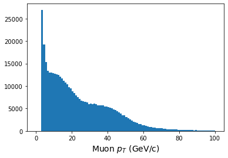

> ## Why awkward?
> A natural question to ask would be "*Why do I have to learn about awkward? Why can't I just
> use numpy?*" And yes, those are two questions. :)  The quick answers are: you don't have to
> and you can! But let's dig deeper.
>
> Awkward-array is a newer python tool written by Jim Pivarski (Princeton) and others that 
> allows for very fast manipulation of ``*jagged*" arrays, like we find in HEP. You definitely
> don't *have* to use it, but we present it here because it can speed things up considerably...if
> you know how to write your code. 
> 
> Similarly, you can of course use standard `numpy` arrays for many parts of your analysis, but 
> your data may not always fit into `numpy` arrays without some careful attention to your code. 
> In either case, you'll want to think about how to work with your data once you get it out
> of your file.
>
{: .testimonial}

# Environment

We'll assume that you have a working, modern python environmnt (3.8 or higher) and
we leave it up to you whether or not you write and execute this code in a script
or as a Jupyter notebook.

# Numpy arrays: a review

Before we dive into `awkward` lets review some of the awsome aspects of `numpy`
arrays...and also examine their limitations. 

Let's import `numpy`.

~~~
import numpy as np
~~~
{: .language-python}

Next, let's make a simple `numpy` array to use for our exmples.

~~~
x = np.array([1, 2, 3, 4])
print(x)
~~~
{: .language-python}

~~~
[1 2 3 4]
~~~
{: .output}

Numpy arrays are great because we can perform mathematical operations on them 
and the operation is quickly and efficiently carried out on every member of the array.

~~~
y = 2*x
print(y)
print() # This just puts a blank line between our other print statements

z = x**2
print(z)
print()

a = np.sqrt(x)
print(a)
~~~
{: .language-python}

~~~
[2 4 6 8]

[ 1  4  9 16]

[1.         1.41421356 1.73205081 2.        ]
~~~
{: .output}

Note that in that last operation where we take the square root, we made use of a 
`numpy` function `sqrt`. That function ``knows" how to operate on the elements of
a numpy array, as opposed to the standard python `math` library which does *not* know
how to work with `numpy` arrays. 

So this seems great! However, `numpy` arrays break down when you have arrays
that are not 1D and cannot be expressed in a regular ``n x m" format. 
For example, suppose you have two events and each event has two muons and you 
want to store the transverse momentum ($$p_T$$) for these muons in a `numpy` array.

~~~
pt = np.array([[20.9, 12.3], [127.1, 60.2]])
x = 2*pt

print(pt)
print()
print(x)
~~~
{: .language-python}

~~~
[[ 20.9  12.3]
 [127.1  60.2]]

 [[ 41.8  24.6]
  [254.2 120.4]]
~~~
{: .output}

Great! Everything looks good and we get our expected behavior!

Now, suppose there are *3* muons in the second event. Does this still work?

~~~
pt = np.array([[20.9, 12.3], [127.1, 60.2, 23.8]])
x = 2*pt

print(x)
~~~
{: .language-python}

~~~
[list([20.9, 12.3, 20.9, 12.3])
     list([127.1, 60.2, 23.8, 127.1, 60.2, 23.8])]
~~~
{: .output}

Wait...what??? It looks like it just duplicated the entries so now it looks
like we're storing information for *4* muons in the first event and *6* muons
in the second event! A closer looks shows us that while `pt` is a `numpy`
array, the elements are not arrays but python `list` objects, which behave differently. 

The reason this happened is that `numpy` arrays can't deal with this type of 
``jagged" behavior where the first row of your data might have 2 elements
and the second row might have 3 elements and the third row might have 0 elements
and so on. For that, we need `awkward-array`. 

# Access or download a ROOT file for use with this exercise

We'll work with the same file as in the previous lesson. If you have jumped straight to
this lesson, please go back and review how to access the file over the network 
or by downloading it. 

# Open the file

*Stop!* If you haven't already, make sure you have run through the 
[previous lesson](https://cms-opendata-workshop.github.io/workshop2022-lesson-cpp-root-python/07-uproot/index.html) on working with uproot.

Let's open this ROOT file! 
If you're writing a python script, let's call it `open_root_file_and_analyze_data.py` and if you're using
a Jupyter notebook, let's call it `open_root_file_and_analyze_data.ipynb`. 

First we will import the `uproot` library, as well as some other standard
libraries. These can be the first lines of your python script or the first cell of your Jupyter notebook.

*If this is a script, you may want to run `python open_root_file_and_analyze_data.py` every few lines or so to see the output.
If this is a Jupyter notebook, you will want to put each snippet of code in its own cell and execute
them as you go to see the output.*

~~~
import numpy as np
import matplotlib.pylab as plt
import time

import uproot
import awkward as ak
~~~
{: .language-python}

Let's open the file and pull out some data.

~~~
# Depending on if you downloaded the file or not, you'll use either
infile_name = 'root://eospublic.cern.ch//eos/opendata/cms/derived-data/AOD2NanoAODOutreachTool/ForHiggsTo4Leptons/SMHiggsToZZTo4L.root'
# or 
#infile_name = 'SMHiggsToZZTo4L.root'
# Uncomment the above line if you downloaded the file.

infile = uproot.open(infile_name)

events = infile['Events']

pt = events['Muon_pt']
eta = events['Muon_eta']
phi = events['Muon_phi']
~~~
{: .language-python}

Let's inspect these objects a little closer. To access the actual values, we'll see
we need to use the `.array()` member function.

~~~
print(pt)
print()

print(pt.array())
print()

print(len(pt.array()))
print()

for i in range(5):
    print(pt.array()[i])
~~~
{: .language-python}

~~~
<TBranch 'Muon_pt' at 0x7f01513a5c88>

[[63, 38.1, 4.05], [], [], [54.3, 23.5, ... 43.1], [4.32, 4.36, 5.63, 4.75], [], []]

299973

[63, 38.1, 4.05]
[]
[]
[54.3, 23.5, 52.9, 4.33, 5.35, 8.39, 3.49]
[]
~~~
{: .output}

Taking a closer look at the entries, we see different numbers of values in each ``row", where
the rows correspond to events recorded in the CMS detector. 

So can we use manipulate this object like a numpy array? Yes! If we're careful about accessing
the array properly.

~~~
x = 2*pt.array()

print(x[0:5])
~~~
{: .language-python}

~~~
[[126, 76.2, 8.1], [], [], [109, 47, 106, 8.66, 10.7, 16.8, 6.98], []]
~~~
{: .output}

When we histogram, however, we need to make use of the `awkward.flatten` function.
This turns our `awkward` array into a 1-dimensional array, so that we lose all record of
what muon belonged to which event. 

~~~
print(ak.flatten(pt.array()))

plt.figure()
plt.hist(ak.flatten(pt.array()),bins=100,range=(0,100));
plt.xlabel(r'Muon $p_T$ (GeV/c)',fontsize=14)
~~~
{: .language-python}

~~~
[63, 38.1, 4.05, 54.3, 23.5, 52.9, 4.33, ... 32.6, 43.1, 4.32, 4.36, 5.63, 4.75]
~~~
{: .output}

We can also manipulate the data quite quickly. Let's see how!

This sample file is Monte Carlo data that simulates the decay of Higgs bosons
to 4 charged leptons. Let's look for decays to 4 muons, where there are
two positively charged muons and 2 negatively charged muons. 

Since the data stores momentum information as $$p_T, \eta, \phi$$, 
first we'll calculate the Cartesian $$x,y,z$$ components of momentum, and then
we'll *loop* over our events to calculate an invariant mass. We'll find that
looping over the entries is slow, but there is a faster way!

First the slow but explicit way. 

> ## Python code
~~~
> # Some helper functions
> 
> def energy(m, px, py, pz):    
>     E = np.sqrt( (m**2) + (px**2 + py**2 + pz**2))
>     return E
>    
> def invmass(E, px, py, pz):
>     m2 = (E**2) - (px**2 + py**2 + pz**2)
>    
>     if m2 < 0:
>         m = -np.sqrt(-m2)
>     else:
>         m = np.sqrt(m2)
>     return m
>
> def convert(pt, eta, phi):
>     px = pt * np.cos(phi)
>     py = pt * np.sin(phi)
>     pz = pt * np.sinh(eta)
>     
>     return px, py, pz
> 
> # Convert momentum to x,y,z components
> 
> muon_number = events['nMuon'].array()
> 
> pt = events['Muon_pt'].array()
> eta = events['Muon_eta'].array()
> phi = events['Muon_phi'].array()
> muon_q = events['Muon_charge'].array()
> mass = events['Muon_mass'].array()
> 
> muon_px,muon_py,muon_pz = convert(pt, eta, phi)
> muon_e = energy(mass, muon_px, muon_py, muon_pz)
> 
> # Do the calculation
> 
> masses = []
> 
> nevents = len(pt)
> print(f"Nevents: {nevents}")
> 
> start = time.time()
> 
> for n in range(nevents):
> 
>     if n%10000==0:
>         print(n)
> 
>     nmuons = muon_number[n]
>     
>     e = muon_e[n]
>     q = muon_q[n]
>     px = muon_px[n] 
>     py = muon_py[n]
>     pz = muon_pz[n]
>     
> 
>     if nmuons < 4:
>         continue
>     
>     for i in range(0, nmuons-3):
>         for j in range(i+1, nmuons-2):
>             for k in range(j+1, nmuons-1):
>                 for l in range(k+1, nmuons):
> 
>                     if q[i] + q[j] + q[k] + q[l] == 0:
>                         etot = e[i] + e[j] + e[k] + e[l]
>                         pxtot = px[i] + px[j] + px[k] + px[l]
>                         pytot = py[i] + py[j] + py[k] + py[l]
>                         pztot = pz[i] + pz[j] + pz[k] + pz[l]
> 
>                         m = invmass(etot, pxtot, pytot, pztot)
>                         masses.append(m)
>                         
> print(f"Time to run: {(time.time() - start)} seconds") 
> 
> # Plot the results
> 
> plt.figure()
> plt.hist(masses,bins=140,range=(80,150))
> plt.xlabel(r'4-muon invariant mass (GeV/c$^2$',fontsize=18)
> plt.show()
> ~~~
> {: .language-python}
{: .solution}

~~~

~~~
{: .output}

When I run this on my laptop, it takes a little over 3 minutes to run. Is there a better way? 

Yes!

We've adapted some code from 
[this tutorial](https://hsf-training.github.io/hsf-training-scikit-hep-webpage/04-awkward/index.html), 
put together by the HEP Software Foundation to show you 
how much faster using the built-in awkward functions can be. 

> ## Python code
> ~~~
> start = time.time()
> 
> muons = ak.zip({
>     "px": muon_px,
>     "py": muon_py,
>     "pz": muon_pz,
>     "e": muon_e,
>     "q": muon_q,
> })
> 
> quads = ak.combinations(muons, 4)
> 
> mu1, mu2, mu3, mu4 = ak.unzip(quads)
> 
> mass_fast = (mu1.e + mu2.e + mu3.e + mu4.e)**2 - ((mu1.px + mu2.px + mu3.px + mu4.px)**2 + (mu1.py + mu2.py + mu3.py + mu4.py)**2 + (mu1.pz + mu2.pz + mu3.pz + mu4.pz)**2)
> 
> mass_fast = np.sqrt(mass_fast)
> 
> qtot = mu1.q + mu2.q + mu3.q + mu4.q
> 
> print(f"Time to run: {(time.time() - start)} seconds") 
> 
> plt.hist(ak.flatten(mass_fast[qtot==0]), bins=140,range=(80,150));
> plt.xlabel(r'4-muon invariant mass (GeV/c$^2$',fontsize=18)
> plt.show()
> ~~~
> {: .language-python}
{: .solution}

On my laptop, this takes less than 0.2 seconds! Note that we are making use of
[boolean arrays to perform masking](https://jakevdp.github.io/PythonDataScienceHandbook/02.06-boolean-arrays-and-masks.html)
when we type `mass_fast[qtot==0]`.

While we cannot teach you *everything* about `awkward`, we hope we've given you a basic introduction
to what it can do and where you can find more information so that you can quickly process
the output of any of your open data jobs and get started on your own analysis!



