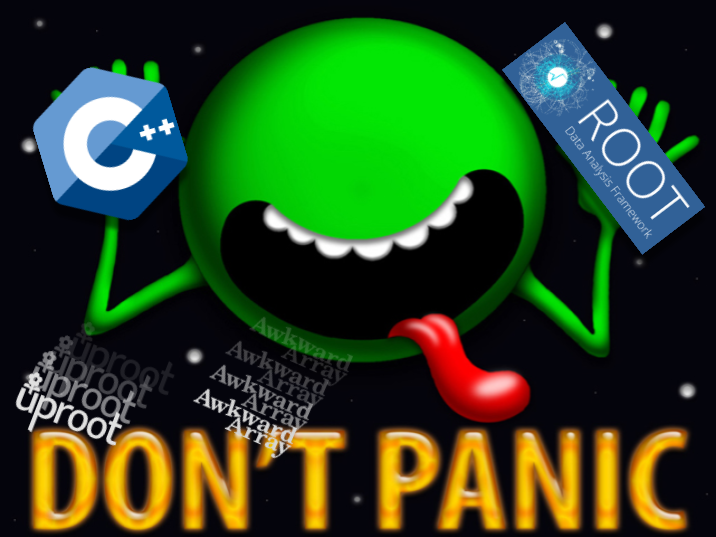

<!--  -->

These pre-exercises are designed to prepare you for working with ROOT files and the broader
ROOT analysis library in two separate contexts:
editing and running much of the pre-existing code used to access
some of the older open data files and then working with more recent, user-friendly 
python libraries to interface with the output files that you will be creating. 

In the first case, you will be editing and/or writing files using C++ and ROOT, and perhaps
examining those files with a python interface to ROOT.
In the second case, you'll use some python libraries ([uproot](https://uproot.readthedocs.io/en/latest/index.html) and [awkward arrays](https://awkward-array.readthedocs.io/en/latest/))
to *read* some ROOT files, but then analyze the data with non-ROOT-specific libraries. 

This is *not* a full introduction to C++ or ROOT or uproot/awkward, however,
we do take time to explain some key concepts that will help you feel more comfortably working
with the open data codebase.

You should definitely take time to go through this exercise before
participating in the workshop.

If you run into problems with any of these steps, please reach out to the organizers
through the dedicated [Mattermost channel for this lesson](https://mattermost.web.cern.ch/cmsodws2023/channels/c-and-python-pre-exercise).
General questions about the workshop as a whole can be posted on the [Mattermost channel for the workshop](https://mattermost.web.cern.ch/cmsodws2023/channels/town-square).

<!-- this is an html comment -->

 This is a comment in Liquid 


